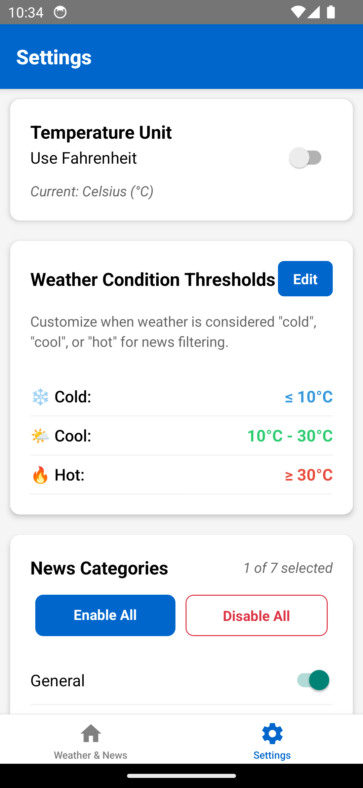
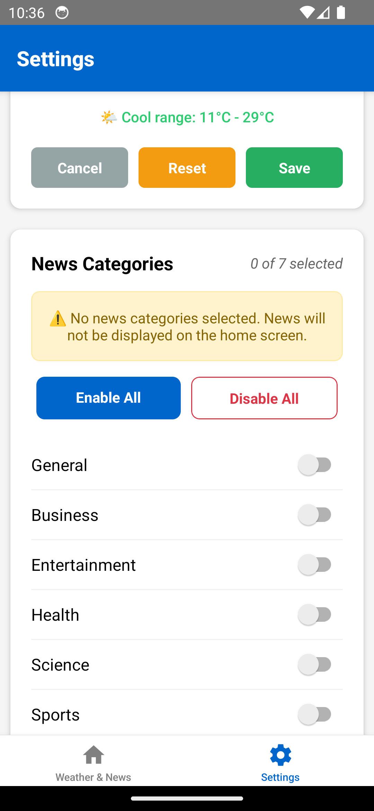

# Weather & News Aggregator

A React Native application that intelligently filters news content based on current weather conditions, providing users with personalized content that adapts to local weather patterns.

## 📋 Overview

This cross-platform mobile application combines real-time weather data with news aggregation, featuring an intelligent filtering system that displays different types of news based on temperature conditions. Built with React Native CLI and TypeScript for reliable performance across iOS and Android platforms.

## ✨ Features

### 🌤️ Weather Integration
- Real-time weather data with 5-day forecast
- GPS-based automatic location detection
- Customizable temperature units (Celsius/Fahrenheit)
- Dynamic weather condition categorization

### 📰 News Filtering System
- **Cold Weather (≤10°C)**: Displays serious/analytical news content
- **Hot Weather (≥30°C)**: Shows alert and safety-related news
- **Moderate Weather (11-29°C)**: Features positive and uplifting news
- Multi-category news support (Business, Technology, Health, Sports, etc.)
- India-focused news sources

### ⚙️ Customization Options
- User-defined temperature thresholds
- Interactive threshold adjustment controls
- News category management
- Personalized filtering preferences

### 🎯 User Experience
- Intuitive bottom tab navigation
- Pull-to-refresh functionality
- Comprehensive error handling
- Loading states and user feedback

## 🛠️ Technology Stack

- **Frontend**: React Native CLI, TypeScript
- **Navigation**: React Navigation v6
- **State Management**: React Context API
- **APIs**: OpenWeatherMap API, NewsAPI
- **Location Services**: React Native Geolocation Service

## 📱 Screenshots

<div align="center">
  <table>
    <tr>
      <td align="center">
        <b>Home Screen</b><br>
        
      </td>
      <td align="center">
        <b>Location Permission</b><br>
        
      </td>
      <td align="center">
        <b>Settings Screen</b><br>
        
      </td>
    </tr>
    <tr>
      <td align="center">
        <b>Weather Threshold</b><br>
        
      </td>
      <td align="center">
        <b>Category Update</b><br>
        
      </td>
      <td align="center">
        <b>Disable Categories</b><br>
        
      </td>
    </tr>
  </table>
</div>

## 📋 Prerequisites

- Node.js (v18 or higher)
- React Native CLI
- Android Studio (for Android development)
- Xcode (for iOS development, macOS only)
- API Keys from OpenWeatherMap and NewsAPI

## 🚀 Installation

1. **Clone the repository**
   ```bash
   git clone https://github.com/username/Weather-News-Aggregator.git
   cd Weather-News-Aggregator
   ```

2. **Install dependencies**
   ```bash
   npm install
   ```

3. **iOS setup** (macOS only)
   ```bash
   cd ios && pod install && cd ..
   ```

4. **Configure API keys**

   Create `src/config/apiKeys.ts`:
   ```typescript
   export const API_KEYS = {
     OPENWEATHER_API_KEY: 'your_openweather_api_key',
     NEWS_API_KEY: 'your_news_api_key',
   };

   export const API_ENDPOINTS = {
     WEATHER_BASE_URL: 'https://api.openweathermap.org/data/2.5',
     NEWS_BASE_URL: 'https://newsapi.org/v2',
   };
   ```

5. **Run the application**
   ```bash
   # Android
   npx react-native run-android

   # iOS
   npx react-native run-ios
   ```

## 🔄 Application Workflow

1. **Initialization**: Request location permissions and detect user location
2. **Data Retrieval**: Fetch current weather conditions and forecast data
3. **Condition Analysis**: Determine weather category based on temperature thresholds
4. **Content Filtering**: Load relevant news content based on weather conditions
5. **Display**: Present weather information and filtered news to user
6. **User Interaction**: Allow threshold customization and category management

## 📁 Project Structure

```
src/
├── components/
│   ├── weather/          # Weather display components
│   └── news/             # News article components
├── screens/
│   ├── HomeScreen.tsx    # Main application screen
│   └── SettingsScreen.tsx # User preferences
├── services/
│   ├── weatherService.ts # Weather API integration
│   ├── newsService.ts    # News API integration
│   └── locationService.ts # Location services
├── context/
│   └── AppContext.tsx    # Application state management
├── utils/
│   ├── weatherUtils.ts   # Weather processing logic
│   └── newsFiltering.ts  # News filtering algorithms
├── types/                # TypeScript type definitions
├── config/               # Application configuration
└── navigation/           # Navigation setup
```

## ⚙️ Configuration

### 🌡️ Temperature Thresholds
Users can customize temperature ranges for weather condition classification:

- **Cold Threshold**: Default ≤10°C (adjustable: -10°C to 25°C)
- **Hot Threshold**: Default ≥30°C (adjustable: 20°C to 50°C)
- **Moderate Range**: Automatically calculated between thresholds

### 📰 News Categories
Available categories include:
- General
- Business
- Entertainment
- Health
- Science
- Sports
- Technology

## 🔌 API Information

### OpenWeatherMap
- **Free Tier**: 1,000 calls/day, 60 calls/minute
- **Endpoint**: Current weather and 5-day forecast

### NewsAPI
- **Free Tier**: 500 requests/day
- **Endpoint**: Top headlines and search functionality

## 🔧 Troubleshooting

### Common Issues

#### 📍 Location Services
- Ensure location permissions are granted
- Verify GPS is enabled on device
- Check network connectivity

#### 📰 News Loading
- Verify API keys are correctly configured
- Check internet connection
- Ensure at least one news category is enabled
- Monitor API rate limits

#### 🌤️ Weather Data
- Confirm OpenWeatherMap API key validity
- Check location service permissions
- Verify network connectivity

### 🐛 Debug Mode
Enable detailed logging by adding console statements in `HomeScreen.tsx`:

```typescript
console.log('Weather condition:', weatherCondition);
console.log('Selected categories:', selectedNewsCategories);
console.log('Articles loaded:', articles.length);
```

## 🤝 Contributing

1. Fork the repository
2. Create a feature branch (`git checkout -b feature/new-feature`)
3. Commit changes (`git commit -am 'Add new feature'`)
4. Push to branch (`git push origin feature/new-feature`)
5. Create a Pull Request

### Development Guidelines
- Follow TypeScript best practices
- Implement proper error handling
- Maintain code documentation
- Include unit tests for new features

<!-- ## 📄 License

This project is licensed under the MIT License.

## 📞 Support

For technical issues or feature requests, please create an issue in the repository or contact the development team. -->

---

<div align="center">
  <b>Built with ❤️ using React Native and TypeScript</b>
</div>